# Nyx

**A bare-metal operating system written in Rust — its own kernel, its own GPU driver, its own
desktop — that runs real hardware, speaks enough of the Linux ABI to run Rust `std`, musl and
libc++ programs, and treats a quantum processor as a compute resource beside the CPU and GPU.**

[](rust-toolchain.toml)
[](License)
[](https://github.com/Asmodeus14/Nyx/actions/workflows/build.yaml)

📚 **Full documentation: [`docs/`](docs/README.md)** — start with the
[architecture overview](docs/ARCHITECTURE.md).

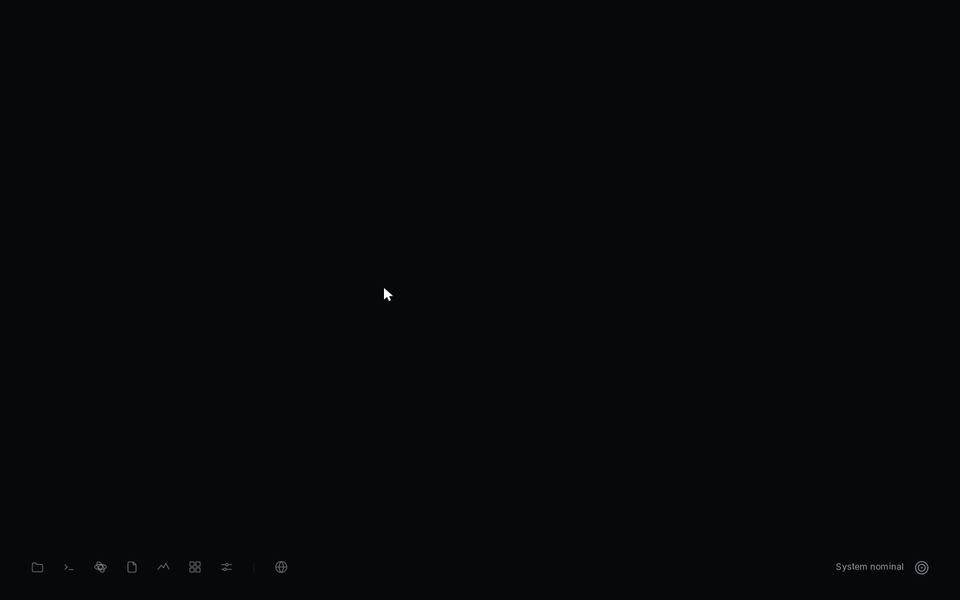

### ▶ Try it in your browser

[](https://codespaces.new/Asmodeus14/Nyx?devcontainer_path=.devcontainer%2Fdemo%2Fdevcontainer.json)

Nothing to install or build: the Codespace downloads the prebuilt image from the
[`demo` release](https://github.com/Asmodeus14/Nyx/releases/tag/demo), boots it in QEMU, and opens the
desktop in a browser tab after a couple of minutes (needs a GitHub account; it uses your Codespaces
quota). To run the same thing locally: [`tools/demo/run-demo.sh`](tools/demo/run-demo.sh). It is
QEMU, so there is no GPU acceleration, Wi-Fi or touchpad — see [`tools/demo/README.md`](tools/demo/README.md).

---

## What Nyx is

- A **monolithic `no_std` Rust kernel** for x86-64, booted through UEFI, with per-core SMP
  scheduling, per-process address spaces and a Linux-numbered syscall interface.
- A **from-scratch Intel GPU stack**: blitter, display control, and a Gen9 3D engine with
  hand-encoded shaders that composites the desktop and draws its text.
- **Meridian**, a desktop whose window server is an ordinary userspace program.
- A **userland** of Rust apps (both `no_std` and real `std`), plus C and C++ through musl and libc++.
- A **quantum subsystem** that models a QPU as a device, simulates circuits locally, and has run a
  Bell state on real IBM quantum hardware — while refusing, by construction, to call a simulator
  "hardware".

Nyx is **pre-alpha**. It is developed against one laptop (Intel Comet Lake, UHD graphics `0x9BC4`)
and also boots in QEMU.

## Screenshots

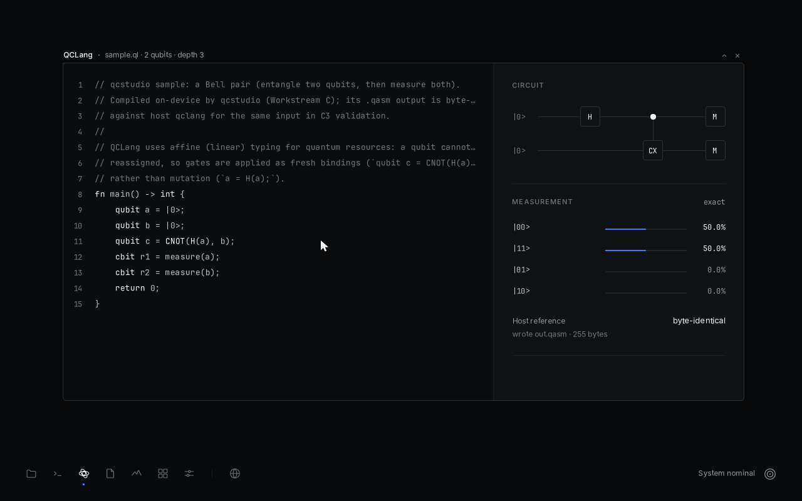

| | | |
|:---:|:---:|:---:|
| 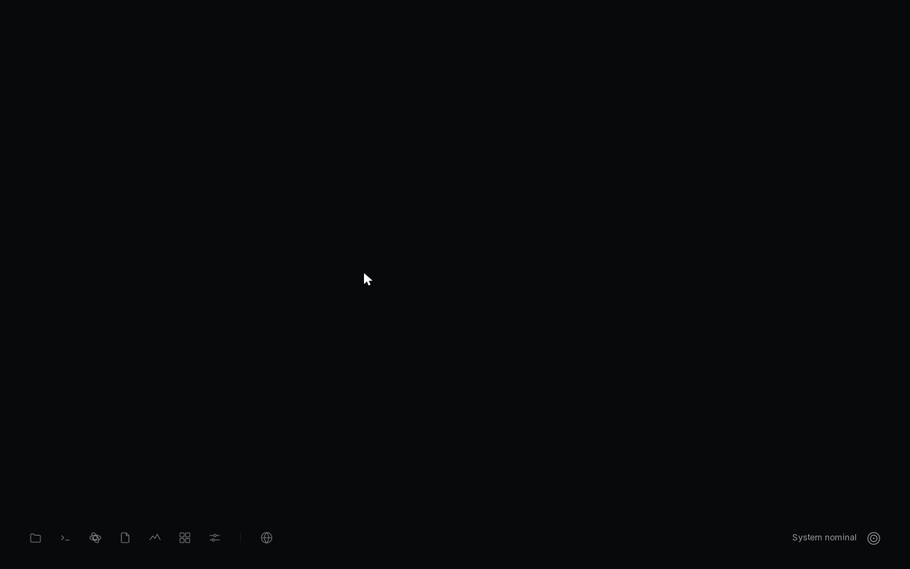 | 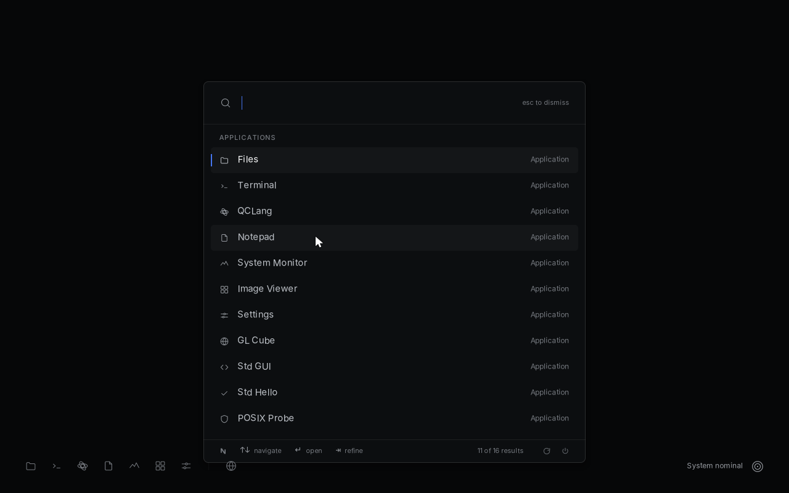 | 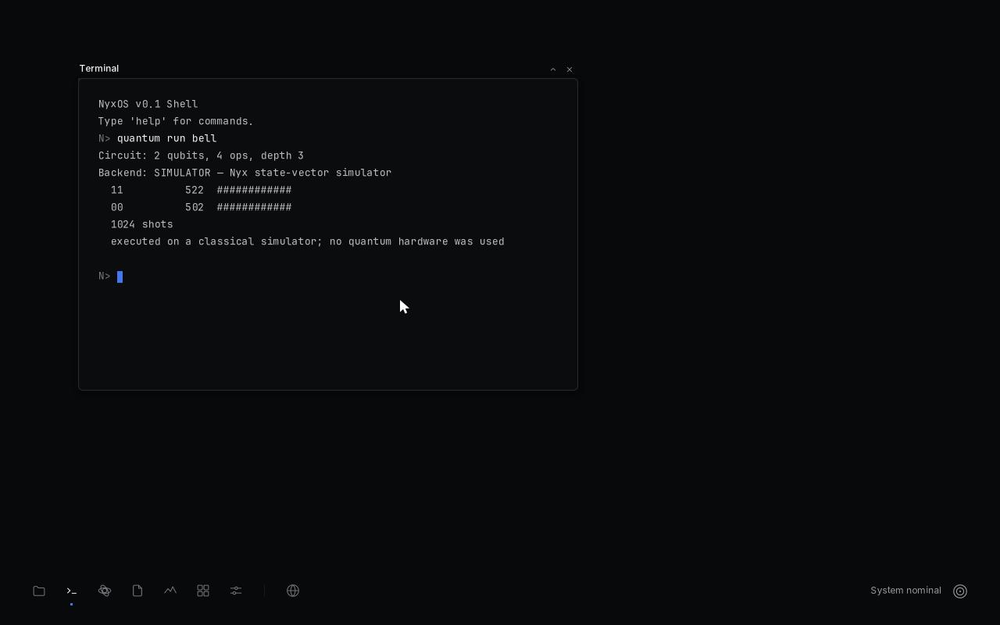 |
| **Desktop** — a dock on the wallpaper, no taskbar | **The Command** (Super key) — search and launch | **Terminal** — `quantum run bell` on the state-vector simulator |
| 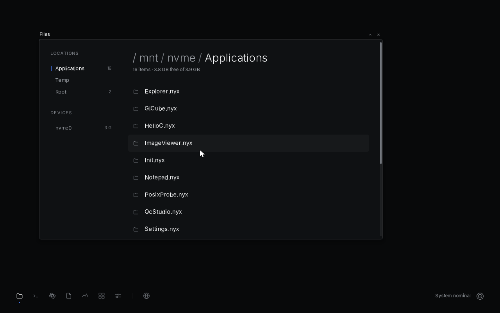 | 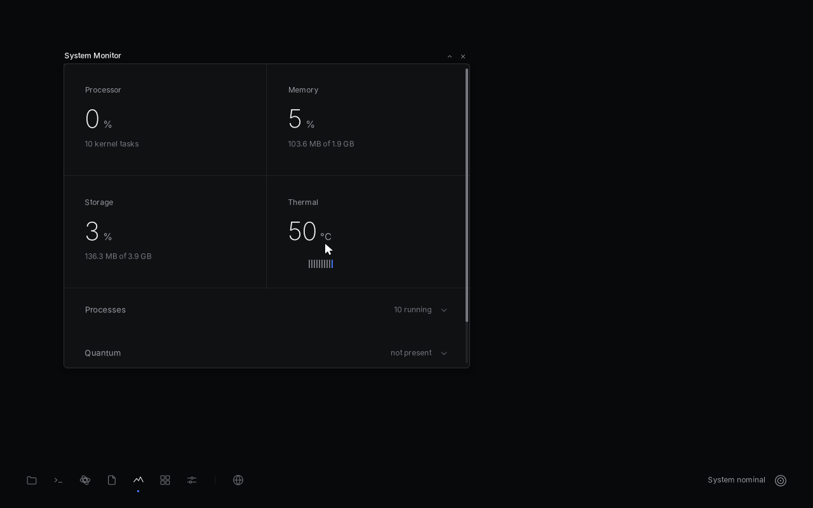 | 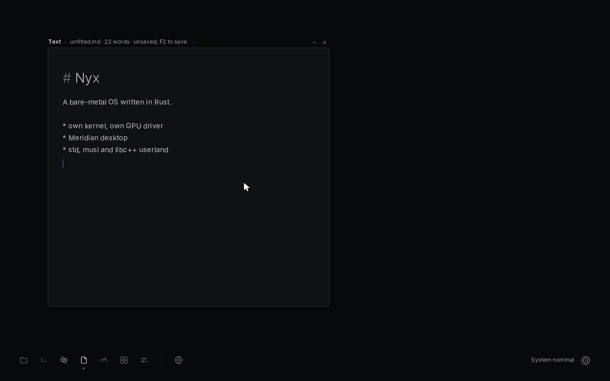 |
| **Files** — the ext4 root on NVMe | **System Monitor** | **Notepad** |
| 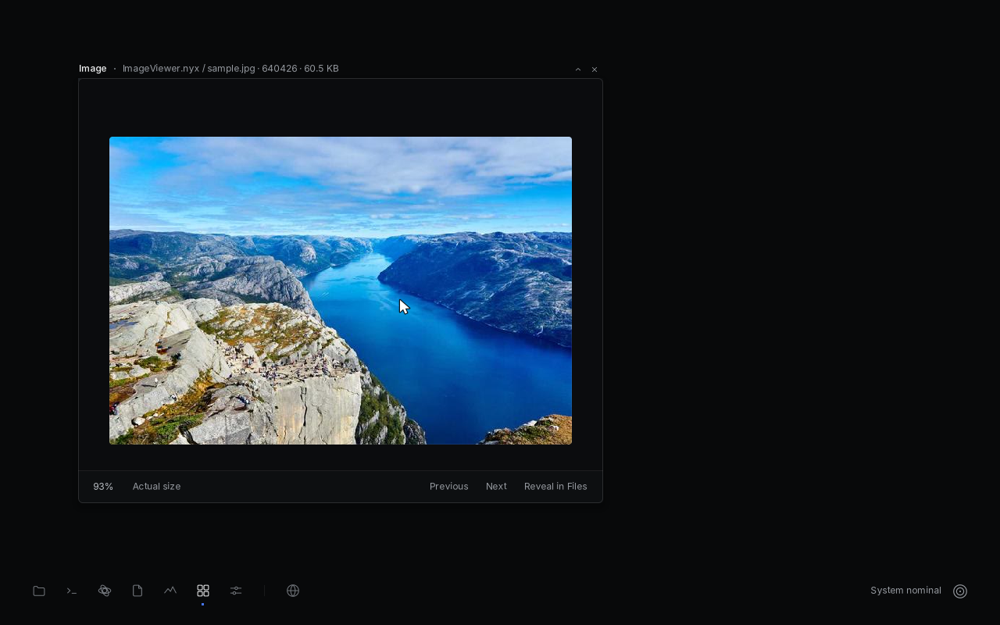 | 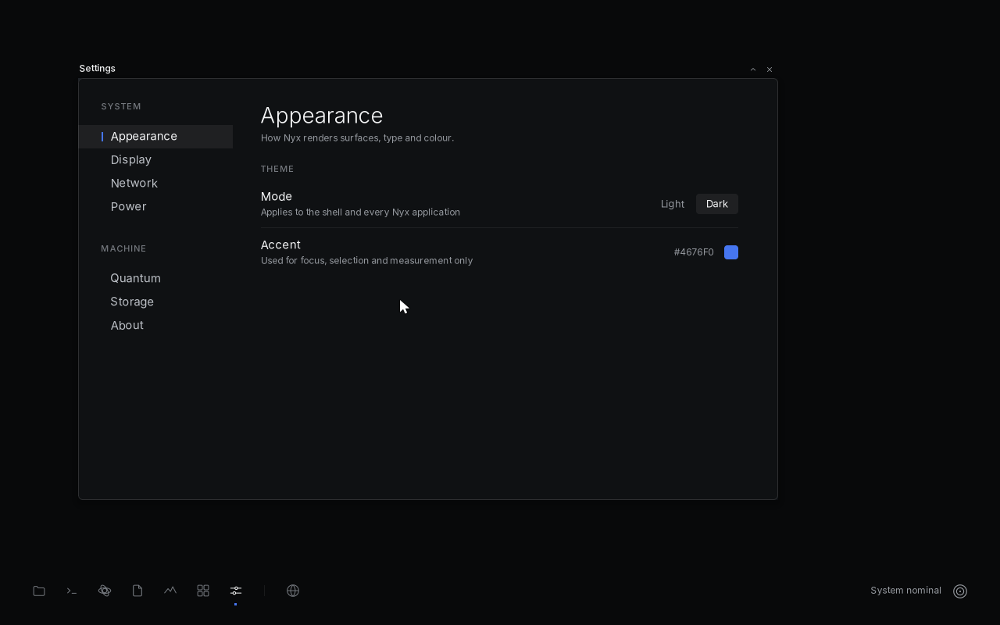 | |
| **Image Viewer** — JPEG decoded on Nyx | **Settings** | |

<sub>Captured from Nyx running in QEMU (`./Build.sh` + the disk image in [BUILD.md](docs/BUILD.md)).
QEMU has no Intel GPU, so these frames were composited on the CPU; on the Intel laptop the GPU
composites the same pixels. Readings such as temperature come from QEMU's emulated hardware.</sub>

## Current status

🟢 implemented · 🟡 experimental · 🔴 broken · 🚧 in progress · ⬜ planned

| Area | Status | Notes |
|---|---|---|
| Boot (UEFI), memory, paging, SMP | 🟢 | per-core schedulers, cross-core wakeups by IPI |
| Syscalls | 🟢 | 65 Linux-numbered + 78 Nyx-native (501–578) — [KERNEL.md](docs/KERNEL.md#system-calls) |
| Rust `std` on Nyx | 🟢 | `target_os = "nyx"`, via Nyx's own platform layer |
| musl / libc++ | 🟢 | C and C++ programs run; a LibCore-style event loop probe passes |
| Storage | 🟢 NVMe + ext4 · 🟡 AHCI | AHCI detects ports only |
| Intel GPU: 2D, display, cursor | 🟢 | [GRAPHICS.md](docs/GRAPHICS.md) |
| Intel GPU: 3D engine, compositing, GPU text | 🟢 | on the Gen9.5 test machine; CPU fallback everywhere |
| Desktop (Meridian) | 🟢 | [UI.md](docs/UI.md) |
| Input | 🟢 PS/2 keyboard, I2C-HID precision touchpad · 🟡 USB HID | touchpad gestures: tap, tap-and-drag, two-finger scroll, three-finger swipe |
| Networking | 🟢 | RTL8168 Ethernet, Intel Wi-Fi (WPA2), DHCP, DNS, TCP, HTTPS |
| Web | 🟢 text browser in the terminal · 🚧 Ladybird port | [ROADMAP.md](docs/ROADMAP.md) |
| Quantum | 🟢 | local simulator, IonQ and IBM providers — [docs/quantum](docs/quantum/architecture.md) |
| Audio, IPv6, modifier-key shortcuts | ⬜ | |

## Architecture

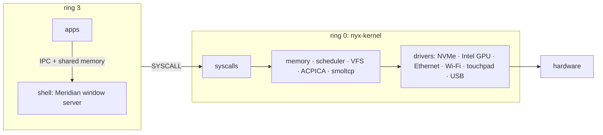

Details: [ARCHITECTURE.md](docs/ARCHITECTURE.md) · [KERNEL.md](docs/KERNEL.md) ·
[GRAPHICS.md](docs/GRAPHICS.md) · [UI.md](docs/UI.md) ·
[network-architecture.md](docs/network-architecture.md)

## Hardware

| | |
|---|---|
| CPU | x86-64 with SSE4.2 and AES-NI — the userspace targets (`targets/x86_64-nyx.json`, `x86_64-unknown-nyx.json`) enable them; AVX is off |
| Firmware | UEFI |
| Storage | an NVMe drive with a GPT Linux partition formatted ext4 (the root filesystem) |
| GPU | Intel Gen9 / Gen9.5 for acceleration; anything else gets the CPU renderer |
| Network | Realtek RTL8168, Intel Wi-Fi 9462-class |
| Verified on | one Comet Lake laptop, and QEMU (no GPU acceleration, Wi-Fi or touchpad there) |

## Build & run

```bash
./Build.sh          # build everything, pack the initrd, build the kernel image, launch QEMU
CI=1 ./Build.sh     # build only
```

Requires the pinned nightly from `rust-toolchain.toml`, `clang` and `lld`. A QEMU boot additionally
needs an NVMe disk image and a couple of flags — see **[BUILD.md](docs/BUILD.md)**, which also covers
hardware flashing, host tests and CI.

## Repository

| Path | |
|---|---|
| `nyx-kernel/` | the kernel (vendored ACPICA and lwext4 inside) |
| `apps/` | userspace programs — `shell` is the window server |
| `libs/` | userspace libraries (`api`, `gui`, `meridian`, `net`, `quantum`, …) |
| `tools/compiler/` | the QCLang compiler — language docs in [`docs/qclang/`](docs/qclang/SYNTAX.md) |
| `tools/runner/` | builds the UEFI image and launches QEMU |
| `tests/` | POSIX conformance probe, `std` tests, C/C++ tests |
| `vendor/` | Nyx's Rust `std` platform layer, musl |
| `docs/` | documentation |

## Contributing

See [CONTRIBUTING.md](CONTRIBUTING.md) and [Code_Of_Conduct.md](Code_Of_Conduct.md). The current
direction and open items are in [ROADMAP.md](docs/ROADMAP.md).

## License

Apache License 2.0 — see [`License`](License) and [`NOTICE.md`](NOTICE.md).

Third-party code keeps its own licence: ACPICA (`nyx-kernel/acpica-core/`, Intel — see its source
headers), lwext4 (`nyx-kernel/lwext4/LICENSE`), the Inter and JetBrains Mono fonts (SIL Open Font
License 1.1, `libs/meridian/fonts/`), and crates from crates.io under their own terms.
