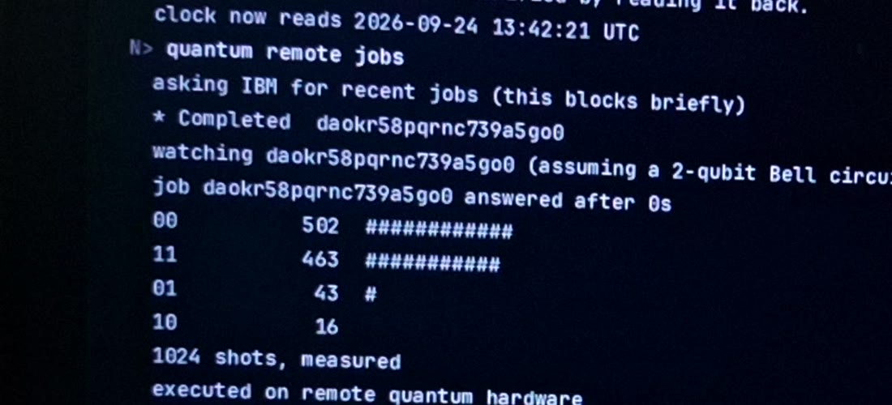
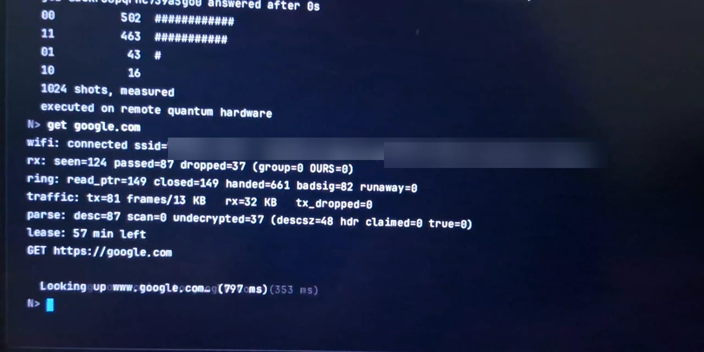
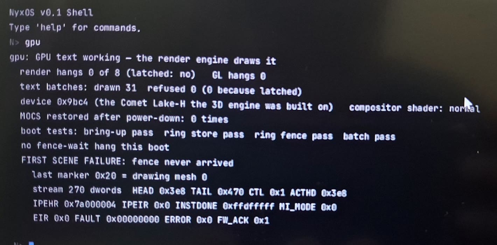
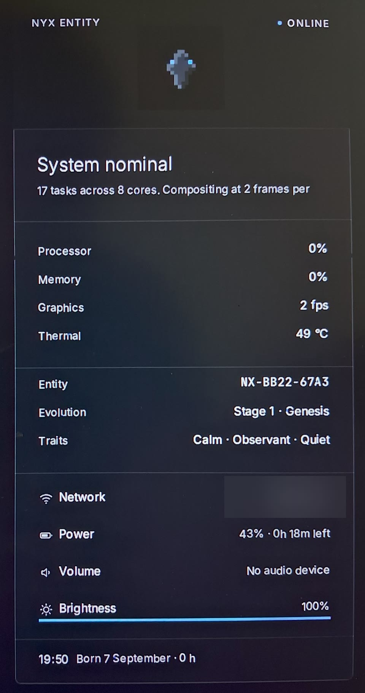
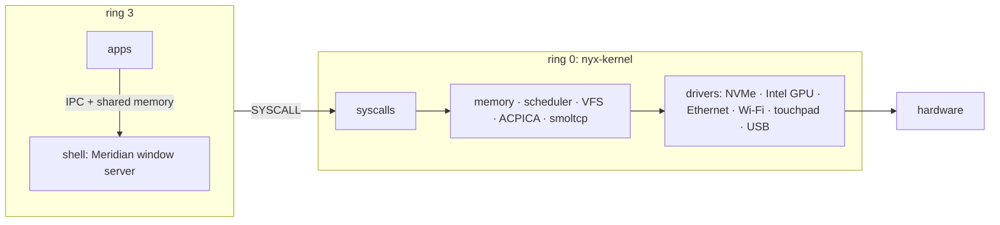

# Nyx

**A Rust operating system that runs on a real laptop, with its own kernel, its own Intel GPU and
Wi-Fi drivers, HTTPS, and results collected from IBM's quantum hardware.**

[](rust-toolchain.toml)
[](License)
[](https://github.com/Asmodeus14/Nyx/actions/workflows/build.yaml)

📚 **Documentation: [`docs/`](docs/README.md)** — start with the [architecture overview](docs/ARCHITECTURE.md).

## On real hardware

Everything in this section was filmed with a phone on the test laptop (Intel Comet Lake, UHD
graphics `0x9BC4`), not in an emulator.

| Results collected from IBM's quantum computer | Wi-Fi and HTTPS |
|:---:|:---:|
|  |  |
| `quantum remote jobs` collects a Bell circuit's result from IBM's `ibm_fez`. A simulator puts **exactly zero** shots in `01` and `10`. The **43** and **16** here are real-device noise. | `get google.com` runs over Nyx's own Wi-Fi driver (its live counters are shown; the network name is blurred), a DHCP lease, and DNS. The HTTPS is rustls running on Nyx's Rust `std` port. |


**GL Cube** (right) is a textured cube drawn by Nyx's **own Gen9 3D engine**, with hand-encoded
shaders, in a window that the GPU composites.
*GL Cube has no software renderer: if the GPU driver fails, the app exits.* QEMU cannot show it,
because QEMU has no Intel GPU.

The GPU reporting on itself (the terminal's `gpu` command): device `0x9bc4`, every boot self-test
passed, 0 render hangs, and 31 GPU text batches drawn with none refused. It also shows that this
boot's *first* scene hung and was recovered by resetting the engine. That hang's cause is still open;
see [GRAPHICS.md](docs/GRAPHICS.md#debugging).

<br clear="right">





The **Entity panel** (right) shows live readings from the laptop: tasks across 8 cores, temperature,
the battery through ACPI, and the backlight. The network name is blurred.

**Videos** (the audio is removed, and the local network details are cut):

- ▶ [Boot and desktop tour](docs/media/nyx-on-hardware.mp4), 53 s: the boot, the Command, a Rust
  `std` window, GL Cube, the image viewer and the status panel.
- ▶ [Terminal: an IBM quantum result, then Google over HTTPS](docs/media/nyx-hardware-terminal.mp4), 22 s.

<br clear="right">

## In QEMU — try it in your browser


[](https://codespaces.new/Asmodeus14/Nyx?devcontainer_path=.devcontainer%2Fdemo%2Fdevcontainer.json)

Nothing to install or build: the Codespace downloads the prebuilt image from the
[latest release](https://github.com/Asmodeus14/Nyx/releases/latest), boots it in QEMU, and opens the
desktop in a browser tab after a couple of minutes (needs a GitHub account; it uses your Codespaces
quota). To run the same thing locally: [`tools/demo/run-demo.sh`](tools/demo/run-demo.sh). It is
QEMU, so there is no GPU acceleration, Wi-Fi or touchpad — see [`tools/demo/README.md`](tools/demo/README.md).

## What Nyx is

- A **monolithic `no_std` Rust kernel** for x86-64, booted through UEFI, with per-core SMP
  scheduling, per-process address spaces and a Linux-numbered syscall interface.
- A **from-scratch Intel GPU stack**: blitter, display control, and a Gen9 3D engine with
  hand-encoded shaders that composites the desktop and draws its text.
- **Its own Wi-Fi and Ethernet drivers**, with TCP/IP from smoltcp and TLS from rustls, running on
  Nyx's own Rust `std` port.
- **Meridian**, a desktop whose window server is an ordinary userspace program.
- A **userland** of Rust apps (both `no_std` and real `std`), plus C and C++ through musl and libc++.
- A **quantum subsystem** that models a QPU as a device, simulates circuits locally, and talks to
  IBM's and IonQ's cloud QPUs. It refuses, by construction, to call a simulator "hardware".

Nyx is **pre-alpha**. It is developed against one laptop and also boots in QEMU.

## Screenshots


| | | |
|:---:|:---:|:---:|
|  |  |  |
| **Desktop** — a dock on the wallpaper, no taskbar | **The Command** (Super key) — search and launch | **Terminal** — `quantum run bell` on the state-vector simulator |
|  |  |  |
| **Files** — the ext4 root on NVMe | **System Monitor** | **Notepad** |
|  |  | |
| **Image Viewer** — JPEG decoded on Nyx | **Settings** | |

<sub>Captured from Nyx running in QEMU (`./Build.sh` + the disk image in [BUILD.md](docs/BUILD.md)).
QEMU has no Intel GPU, so these frames were composited on the CPU; on the Intel laptop the GPU
composites the same pixels. Readings such as temperature come from QEMU's emulated hardware.</sub>

## Current status

🟢 implemented · 🟡 experimental · 🔴 broken · 🚧 in progress · ⬜ planned

| Area | Status | Notes |
|---|---|---|
| Boot (UEFI), memory, paging, SMP | 🟢 | per-core schedulers, cross-core wakeups by IPI |
| Syscalls | 🟢 | 65 Linux-numbered + 78 Nyx-native (501–578) — [KERNEL.md](docs/KERNEL.md#system-calls) |
| Rust `std` on Nyx | 🟢 | `target_os = "nyx"`, via Nyx's own platform layer |
| musl / libc++ | 🟢 | C and C++ programs run; a LibCore-style event loop probe passes |
| Storage | 🟢 NVMe + ext4 · 🟡 AHCI | AHCI detects ports only |
| Intel GPU: 2D, display, cursor | 🟢 | [GRAPHICS.md](docs/GRAPHICS.md) |
| Intel GPU: 3D engine (mini-GL) | 🟢 | GL Cube on the test laptop — no software fallback exists for it |
| Intel GPU: compositing, GPU text | 🟡 | working on the test laptop (the `gpu` photo above), but a boot's first scene can hang and is recovered by an engine reset; cause open. CPU fallback everywhere |
| Desktop (Meridian) | 🟢 | [UI.md](docs/UI.md) |
| Input | 🟢 PS/2 keyboard, I2C-HID precision touchpad · 🟡 USB HID | touchpad gestures: tap, tap-and-drag, two-finger scroll, three-finger swipe |
| Networking | 🟢 | Nyx's own RTL8168 Ethernet and Intel Wi-Fi (WPA2) drivers; TCP/IP from smoltcp; HTTPS from rustls on Nyx's `std` port |
| Web | 🟢 text browser in the terminal · 🚧 Ladybird port | [ROADMAP.md](docs/ROADMAP.md) |
| Quantum | 🟢 | local simulator, IonQ and IBM providers; results collected from IBM hardware (photo above) — [docs/quantum](docs/quantum/architecture.md) |
| Audio, IPv6, modifier-key shortcuts | ⬜ | |

## Architecture



Details: [ARCHITECTURE.md](docs/ARCHITECTURE.md) · [KERNEL.md](docs/KERNEL.md) ·
[GRAPHICS.md](docs/GRAPHICS.md) · [UI.md](docs/UI.md) ·
[network-architecture.md](docs/network-architecture.md)

## Hardware

| | |
|---|---|
| CPU | x86-64 with SSE4.2 and AES-NI — the userspace targets (`targets/x86_64-nyx.json`, `x86_64-unknown-nyx.json`) enable them; AVX is off |
| Firmware | UEFI |
| Storage | an NVMe drive with a GPT Linux partition formatted ext4 (the root filesystem) |
| GPU | Intel Gen9 / Gen9.5 for acceleration; anything else gets the CPU renderer |
| Network | Realtek RTL8168, Intel Wi-Fi 9462-class |
| Verified on | one Comet Lake laptop, and QEMU (no GPU acceleration, Wi-Fi or touchpad there) |

## Build & run

```bash
./Build.sh          # build everything, pack the initrd, build the kernel image, launch QEMU
CI=1 ./Build.sh     # build only
```

Requires the pinned nightly from `rust-toolchain.toml`, `clang` and `lld`. A QEMU boot additionally
needs an NVMe disk image and a couple of flags — see **[BUILD.md](docs/BUILD.md)**, which also covers
hardware flashing, host tests and CI.

## Repository

| Path | |
|---|---|
| `nyx-kernel/` | the kernel (vendored ACPICA and lwext4 inside) |
| `apps/` | userspace programs — `shell` is the window server |
| `libs/` | userspace libraries (`api`, `gui`, `meridian`, `net`, `quantum`, …) |
| `tools/compiler/` | the QCLang compiler — language docs in [`docs/qclang/`](docs/qclang/SYNTAX.md) |
| `tools/runner/` | builds the UEFI image and launches QEMU |
| `tests/` | POSIX conformance probe, `std` tests, C/C++ tests |
| `vendor/` | Nyx's Rust `std` platform layer, musl |
| `docs/` | documentation |

## Contributing

See [CONTRIBUTING.md](CONTRIBUTING.md) and [Code_Of_Conduct.md](Code_Of_Conduct.md). The current
direction and open items are in [ROADMAP.md](docs/ROADMAP.md).

## License

Apache License 2.0 — see [`License`](License) and [`NOTICE.md`](NOTICE.md).

Third-party code keeps its own licence: ACPICA (`nyx-kernel/acpica-core/`, Intel — see its source
headers), lwext4 (`nyx-kernel/lwext4/LICENSE`), the Inter and JetBrains Mono fonts (SIL Open Font
License 1.1, `libs/meridian/fonts/`), and crates from crates.io under their own terms.
