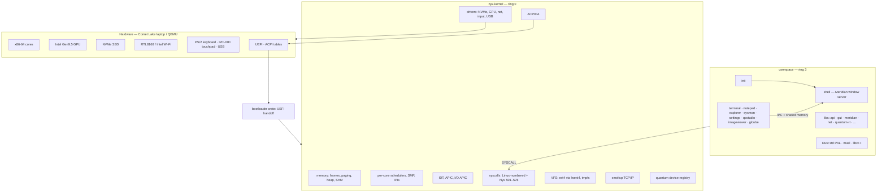

# Architecture

Nyx is a monolithic kernel in Rust with a small userspace of Rust (and now C/C++) programs. This page
is the map; each box links to the document that explains it.

## The system at a glance



| Layer | Document |
|---|---|
| Boot, memory, scheduling, interrupts, syscalls, drivers, ACPI | [KERNEL.md](KERNEL.md) |
| Intel GPU: blitter, display, 3D engine, compositor, GPU text | [GRAPHICS.md](GRAPHICS.md) |
| Desktop, window protocol, apps | [UI.md](UI.md) |
| Networking and HTTPS | [network-architecture.md](network-architecture.md), [https.md](https.md) |
| Quantum subsystem | [quantum/architecture.md](quantum/architecture.md) |

## Design decisions that shape everything

- **Linux-shaped syscalls.** The low syscall numbers follow the Linux x86-64 ABI, so Rust `std`
  (through Nyx's own platform layer in `vendor/nyx-std/`) and stock musl run without an ABI shim.
  Nyx-specific services live at 501 and up.
- **One process draws the screen.** `apps/shell` owns the display; apps draw into shared-memory
  buffers and exchange IPC messages with it. The GPU composites those buffers; the CPU is always
  the fallback.
- **Per-core scheduling with explicit wakers.** Every blocked task records *why* it is blocked, so
  interrupts and IPC wake exactly the tasks waiting on them — on any core — and kick that core with
  an IPI.
- **Hardware is discovered, not assumed.** PCI enumeration, ACPI (a full vendored ACPICA), and the
  I2C-HID touchpad's address and interrupt all come from firmware tables at boot.
- **Diagnostics are part of the system.** The test laptop has no serial console, so the kernel
  records what it measures (scheduler latency, GPU hangs, touchpad reports, ACPI output) and the
  terminal prints it.

## Repository map

```text
nyx-kernel/           the kernel
  src/                  boot (main.rs), memory, scheduler, interrupts + syscalls, vfs, acpi, smp…
  src/drivers/          nvme, ahci, gpu/intel (+ render/), net (rtl8168, iwlwifi), i2c, i2c_hid
  acpica-core/, lwext4/ vendored C: ACPICA, lwext4
apps/                 userspace programs (one crate each)
libs/                 shared userspace libraries
tools/compiler/       QCLang compiler (qclang) — docs in docs/qclang/
tools/runner/         wraps the kernel in a UEFI image and launches QEMU
tools/                check_dup_syscall_arms.sh, gen9_decode.py, icon generator
tests/                posix probe, std tests, C/C++ tests (helloc)
targets/              custom target specs + kernel linker script
vendor/               nyx-std (Rust std platform layer), musl + patches
nyx-recv/             debugging captures: the test laptop's ACPI tables (DSDT decompiled), UDP log tools
docs/                 this documentation
```
