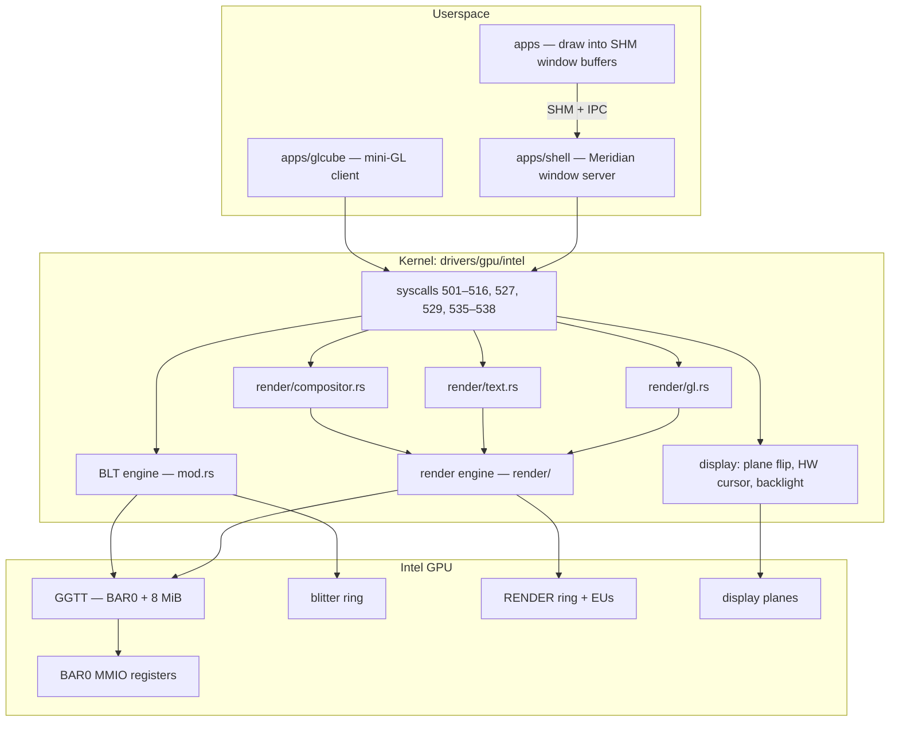
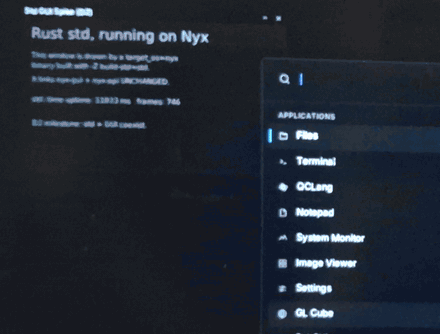

# Graphics

Nyx drives the Intel integrated GPU directly: no firmware graphics protocol after boot, no Mesa, no
i915 — its own command streams, page tables and hand-encoded shaders. Everything here runs on the
development laptop's **Gen9.5 Comet Lake GPU (`0x9BC4`)**; QEMU has no Intel GPU, so under QEMU every
GPU path falls back to the CPU.

Status markers: 🟢 implemented · 🟡 experimental · 🔴 broken · 🚧 in progress · ⬜ planned.

## The stack

## Device bring-up

| | Status | Where |
|---|---|---|
| PCI discovery, BAR0 mapping | 🟢 | `pci.rs` → `IntelGpuDriver::new` |
| Supported IDs | 🟢 Gen9/Gen9.5 (Skylake, Kaby Lake, Coffee Lake, Comet Lake) | `GpuGeneration::probe` |
| Gen11 (`0x8A56`) / Gen12 (`0x9A49`) | 🟡 recognised and handed the same driver, which assumes Gen9 registers. **Verification required** — untested | `intel/mod.rs` |
| GGTT | 🟢 8-byte PTEs written at BAR0 + 8 MiB (`map_ggtt_page`) | `intel/mod.rs`, `render/mod.rs` |
| Forcewake | 🟢 blitter (`0xA188`) and render (`0xA278`) domains, held while working and released after 1 s idle so the GT can reach RC6 (`GPU_PARK_IDLE_MS`) | `intel/mod.rs` |

### GPU address space (GGTT virtual addresses)

| GVA | Use |
|---|---|
| `0x1000_0000` | blitter ring |
| `0x1400_0000` | backbuffer (composited frame) |
| `0x1600_0000` – `0x1E00_0000` | render ring, batch, shader kernels, dynamic / surface state, vertex buffers, depth, textures, fence page |
| `0x4000_0000`, `0x5000_0000` | mini-GL supersampled render target, per-context window backbuffer |
| `0x6000_0000` – `0x6400_0000` | GPU text scene state + font atlas |
| `0x7000_0000` – `0x7300_0000` | compositor scene state |

Each render consumer (compositor, text, GL) has **its own** state-buffer GVAs; sharing them once made
one consumer sample another's state.

## 2D: the blitter (BCS)

🟢 `XY_COLOR_BLT` (`fill_rect`, syscall 501) and `XY_SRC_COPY_BLT` (`copy_rect`, 512), submitted on
a legacy ring at `0x1000_0000`, fenced by `sys_gpu_sync` (503). The desktop uses the blitter to lay
down the wallpaper and to present. (`IntelGpuDriver::test_blitter` exists but nothing calls it.)

## Display

| | Status | Notes |
|---|---|---|
| Present | 🟢 `sys_swap_buffers` (502) and the damage-rect variant (538) blit the backbuffer to scanout | only the changed rectangle is presented |
| Owned scanout / page flip | 🟢 the plane's surface register (`PLANE_SURF`, pipe + `0x19C`) is pointed at a kernel-owned buffer; writing it arms the flip at vblank | `intel/mod.rs` |
| vsync | 🟢 `sys_wait_vsync` (513) | |
| Hardware cursor | 🟢 cursor plane armed once, position written straight from the input path (529, 535) | `intel/cursor.rs` |
| Backlight | 🟢 PCH PWM (`BLC_PWM_PCH_CTL1/2` at `0xC8250`/`0xC8254`), syscall 557 | `intel/backlight.rs` |

## 3D: the render engine (RCS)

`drivers/gpu/intel/render/` — a from-scratch Gen9 3D driver in **legacy ring-buffer mode** (no
execlists, no hardware contexts).

| Piece | Status | Where |
|---|---|---|
| Bring-up: reset, forcewake, MOCS tables, ring | 🟢 | `RenderEngine::bring_up` |
| Boot self-tests: ring store, PIPE_CONTROL fence, batch buffer | 🟢 all pass on hardware | `init_render_engine` |
| Ring submission (padded to a qword) | 🟢 | `render/ring.rs` |
| Batch buffers (`MI_BATCH_BUFFER_START`) | 🟢 | `exec_batch` |
| Fences | 🟢 `PIPE_CONTROL` post-sync writes to the fence page; every wait is a microsecond deadline (`SpinDeadline`) | `render/mod.rs`, `pipeline.rs` |
| Shaders | 🟢 hand-encoded EU machine code: pass-through VS; pixel shaders for textured, textured+opacity, rounded-corner mask, text coverage, and a solid-colour diagnostic | `render/eu.rs` |
| Surfaces | 🟢 linear and Y-tiled render targets, sampled textures, binding tables | `render/state.rs` |
| Pipeline | 🟢 multi-mesh scenes, back-face culling, src-over blending, SSAA (2×2 supersample + resolve pass) | `render/pipeline.rs`, `engine.rs` |
| Command decoder (offline) | 🟢 `tools/gen9_decode.py` against Mesa's gen9 genxml | |

### Consumers

| | Syscall | Status |
|---|---|---|
| **Window compositor** — every window is one textured quad sampling its GGTT-mapped SHM buffer, with per-window opacity | 536 | 🟢 |
| **GPU text** — glyph quads sampling the shell's coverage atlas | 537 | 🟢 |
| **mini-GL** — textured meshes, SSAA, resolved into the app's own window | 514–516, 527 | 🟢 (`apps/glcube`) |

`apps/glcube` on the test laptop, filmed with a phone — mini-GL rendering into a window that the
GPU compositor then composites. Full video: [nyx-on-hardware.mp4](media/nyx-on-hardware.mp4).

**Fallback is always the CPU.** If the engine is missing or has failed, composites return false and
the shell composites on the CPU; refused text is drawn by the shell from the *same* atlas on the
CPU. After 8 consecutive failures (`RENDER_HANG_LIMIT`) the engine is latched off for the compositor
and text so a dead GPU costs nothing per frame; the GL path keeps its own count.

## Debugging

The laptop has no serial console, so the GPU reports on itself through the terminal:

| Command | Shows |
|---|---|
| `gpu` | device ID, boot self-test results, hang latch, text drawn/refused, MOCS restores, and the **first failed scene**: the last progress marker the stream reached (which setup stage, or which mesh), stream length, and `HEAD`/`TAIL`/`ACTHD`/`IPEHR`/`INSTDONE`/fault registers |
| `gpu retry solid\|tex\|normal` | clear the latch and retry the compositor with a different pixel shader — bisects a pixel-stage hang |
| `tools/gen9_decode.py` | offline decode of a captured command stream |

### Resolved bugs worth knowing

| Symptom | Cause | Fix |
|---|---|---|
| Every composite and text draw hung; engine latched off within a second of boot | After idle, the GT enters **RC6**, which wipes the **MOCS** tables (no hardware context to restore them) while the ring registers survive; the compositor and text paths never re-checked them | `ensure_ready` re-programs MOCS whenever entry 0 has been lost, and every render path calls it |
| Batch buffers never completed | Ring `TAIL` must be **qword-aligned** — the 3-dword `MI_BATCH_BUFFER_START` left it odd | `rcs_submit` pads to an even dword count with `MI_NOOP` |
| Nothing rasterised | `CULL_MODE` 0 is *cull both* on Gen9, not *none* | cull mode set explicitly |
| Shaders did nothing | pre-Xe EU opcodes differ from later docs (mov = 1, send = 49) | encoder fixed; its self-test had shared the error |
| Render-target writes lost | the RT-write message must be **headerless** here | `rt_write_desc` |
| Panic screen reached the panel only partly, in 64-byte runs of old content | framebuffer writes still sitting in CPU caches / write-combining buffers | `panic_screen.rs` drains with `sfence` + `wbinvd` |
