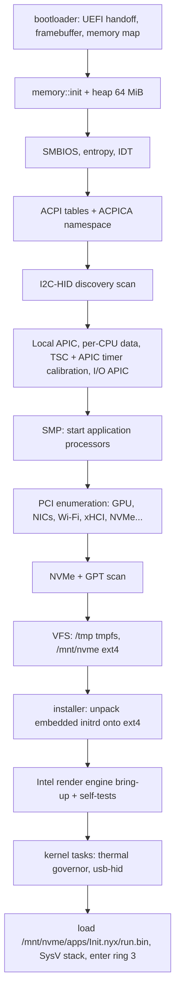

# The Nyx kernel

`nyx-kernel/` — a monolithic `#![no_std]` Rust kernel for `x86_64-unknown-none`, booted by the
`bootloader` crate's UEFI path (framebuffer handoff). All kernel code runs in ring 0 in one address
space; each process runs in ring 3 with its own page tables.

Status markers: 🟢 implemented · 🟡 experimental · 🔴 broken · 🚧 in progress · ⬜ planned.

## Boot sequence

The order in `kernel_main` (`nyx-kernel/src/main.rs`):

`init` (`apps/init`) then starts the userspace system, including the window server `apps/shell`.

## Memory

| | Where | Status |
|---|---|---|
| Physical frames | `BootInfoFrameAllocator` in `memory.rs`, from the bootloader's memory map | 🟢 |
| Low memory | Nothing below 1 MiB is ever handed out (`memory::LOW_MEM_RESERVED`) — the SMP real-mode trampoline lives there | 🟢 |
| Paging | 4-level page tables via the `x86_64` crate; per-process CR3; `fork` clones the user half | 🟢 |
| Kernel heap | `linked_list_allocator`, 64 MiB at `0x4444_4444_0000` (`allocator.rs`) | 🟢 |
| User memory | `mmap`/`munmap`/`mprotect` (9/11/10); `brk` (12) is a stub returning 0 | 🟢 |
| W^X | ELF segment permissions are honoured; user stacks are NX | 🟢 |
| Shared memory | `create_shm_block` / `map_shm` (530/531), unmap/destroy (540/539) — window buffers | 🟢 |
| MMIO for userspace | `map_user_mmio`, `sys_map_framebuffer` (508) | 🟢 |

## Scheduling and SMP

- **Per-core schedulers.** Each core owns a `Scheduler` in its `PerCpu` block (`percpu.rs`); task
  slots are pre-reserved (`TASK_SLOTS = 192`) so other cores can read a core's task list safely.
- **Placement.** New tasks go to the least-loaded core (`scheduler::place_task`), handed over through
  the target core's `inbox` — only a core itself ever pushes to its own task list.
- **Preemption.** Local APIC timer on vector `0x40`, calibrated at boot (`apic::calibrate_timer`,
  period in `apic::TICK_PERIOD_US`); voluntary yield is `int 0x41`.
- **Blocking with a reason.** A blocked task records a `WaitReason` (`Timer`, `Ipc`, `Input`, `Futex`,
  `Child`), so wakers only wake the tasks waiting on them.
- **Cross-core wakeups.** Keyboard/mouse interrupts wake input waiters on **every** core
  (`scheduler::wake_input_waiters`), and `ipc_send` wakes a receiver on any core. A core that gains a
  runnable task is sent a **reschedule IPI** (vector `0x42`, `scheduler::kick_core`) instead of
  waiting for its next tick.
- **Instrumentation.** `schedstats.rs` keeps per-core counters, latency histograms and a record of
  long interrupts-off stretches; the terminal's `sched` command prints them (syscall 575).

## Interrupts

| Vector | Source | Handler |
|---|---|---|
| 0, 4, 5, 7, 11, 12, 16, 17, 19 | #DE #OF #BR #NM #NP #SS #MF #AC #XM | kill the faulting process |
| 3 | breakpoint | `breakpoint_handler` |
| 6 | #UD | `ud_handler` — kills only the process |
| 8 | double fault | `double_fault_handler`, on its own IST stack |
| 13 / 14 | #GP / #PF | `gpf_handler` / `pf_handler` — user faults kill only the process |
| `0x21` | PS/2 keyboard (IRQ 1 via I/O APIC) | `keyboard_interrupt_stub` → `keyboard_context_switch` |
| `0x2C` | PS/2 mouse (IRQ 12) | `mouse_interrupt_stub` → `mouse_context_switch` |
| `0x30` | RTL8168 Ethernet (MSI) | `rtl8168_interrupt_handler` |
| `0x31` | Intel Wi-Fi MSI — **programmed in `pci.rs`, but no IDT entry is installed** | none — see note |
| `0x32` | I2C-HID touchpad (level-triggered GSI) | `i2c_hid_interrupt_handler` |
| `0x40` | Local APIC timer | `timer_interrupt_stub` |
| `0x41` | software yield (`int 0x41`) | `yield_interrupt_stub` |
| `0x42` | reschedule IPI | `resched_ipi_stub` |
| — | `SYSCALL` (LSTAR MSR) | `syscall_handler_asm` → `syscall_dispatcher` |

> **Verification required — vector `0x31`.** `pci::setup_wifi_msi` enables MSI with vector `0x31`,
> but `init_idt` registers nothing there; the Wi-Fi driver works by polling. Whether the device can
> ever raise that MSI (and what happens if it does) has not been established.

The legacy 8259 PIC is initialised during early boot and then superseded by the local APIC + I/O APIC.

## System calls

`SYSCALL`/`SYSRET` with the Linux x86-64 register convention: number in `RAX`; arguments in `RDI`,
`RSI`, `RDX`, `R10`, `R8`, `R9`; result in `RAX`, negative errno on error. `swapgs` on entry and
exit. **The dispatcher (`syscall_dispatch_inner` in `nyx-kernel/src/interrupts.rs`) is the only
authoritative list**; wrappers live in `libs/api`.

⚠️ `interrupts.rs` compiles with warnings allowed, so a duplicate match arm silently shadows the
original instead of failing the build. Run `tools/check_dup_syscall_arms.sh` before adding one.
**501–578 are all taken; the next free native number is 579.**

> ⚠️ **Known gap:** most arms validate user pointers with `is_valid_user_ptr` / `user_cstr`, but
> not all — 510, 511, 541, 542 and 558 use user pointers unchecked (as of this audit). There is no
> capability or permission model. See [`quantum/security.md`](quantum/security.md).

### Linux-numbered (65 numbers)

Enough of Linux's ABI for Rust `std` (via Nyx's PAL) and **musl** to run unmodified.

| Area | Numbers |
|---|---|
| Files | 0 read · 1 write · 2 open *(Nyx form: `ptr, len, flags`)* · 3 close · 4 stat · 5 fstat · 6 lstat · 8 lseek · 16 ioctl · 17/18 pread64/pwrite64 · 19 readv · 20 writev · 21 access · 72 fcntl · 257 openat · 262 newfstatat |
| Directories / paths | 79 getcwd · 80 chdir · 82 rename · 83 mkdir · 84 rmdir · 87 unlink · 88 symlink · 217 getdents64 · 263 unlinkat |
| Descriptors / IPC | 22 pipe · 293 pipe2 · 32 dup · 33 dup2 · 53 socketpair |
| Readiness | 7 poll · 23 select — both return `EINTR` when a caught signal arrives |
| Memory | 9 mmap · 10 mprotect · 11 munmap · 12 brk *(stub)* |
| Processes / threads | 56 clone · 57 fork · 58 *spawn_thread (Nyx-specific)* · 59 execve · 60 exit · 231 exit_group · 61 wait4 · 39 getpid · 186 gettid · 158 arch_prctl · 218 set_tid_address · 24 sched_yield · 202 futex |
| Signals | 13 rt_sigaction · 14 rt_sigprocmask · 15 rt_sigreturn · 62 kill · 200 tkill · 234 tgkill · 131 sigaltstack |
| Time | 35 nanosleep · 228 clock_gettime · 230 clock_nanosleep |
| Network | 41 socket · 42 connect · 44 sendto · 45 recvfrom |
| Misc | 318 getrandom |

### Nyx native (501–578)

Names are the `libs/api` wrappers.

| Range | Area | Syscalls |
|---|---|---|
| 501–503, 509, 512–513, 538 | 2D GPU / present | `sys_gpu_fill_rect`, `sys_swap_buffers`, `sys_gpu_sync`, `sys_gpu_map_shm`, `sys_gpu_copy_rect`, `sys_wait_vsync`, `sys_swap_buffers_rect` |
| 514–516, 527 | mini-GL | `sys_gl_init`, `sys_gl_upload_mesh`, `sys_gl_render`, `sys_gl_reset` |
| 536–537 | GPU compositor / text | `sys_gpu_composite`, `sys_gpu_draw_text` |
| 529, 535 | hardware cursor | `sys_cursor_init`, `sys_cursor_set_image` |
| 504–508 | time, input, screen | `sys_get_time` (uptime ms), `sys_get_mouse`, `sys_read_key`, `sys_get_screen_info`, `sys_map_framebuffer` |
| 576 | input | `sys_read_key_wait` — blocking key read with a timeout |
| 577–578 | touchpad | `sys_i2c_hid_info`, `sys_i2c_hid_*` / `sys_touchpad_*` (op-multiplexed) |
| 510–511, 541–542 | filesystem | `sys_fs_count`, `sys_fs_get_name`, `sys_file_size`, `sys_statfs` |
| 530–533, 539–540 | shared memory + IPC | `sys_create_shm`, `sys_map_shm`, `sys_ipc_send`, `sys_ipc_recv`, `sys_destroy_shm`, `sys_unmap_shm` |
| 534, 572, 549 | DNS, sockets | `sys_dns_resolve`, `sys_dns_resolve_all` (up to 4 addresses); 549 sets a socket's timeout |
| 543–548, 569–571 | Wi-Fi | scan, list, connect, status, disconnect, radio on/off, RX counters and ring diagnostics |
| 517–526, 567, 575 | system info / telemetry | hardware info, boot log, `sys_alloc_pages`, entity state, core count, context switches, system info, `sys_sleep_ms`, DSDT dump, `sys_get_metrics`, `sys_sched_*` (575 is op-multiplexed: scheduler stats, GPU health, keyboard repeat, `gpu retry`) |
| 528, 550, 552–554 | clock | read the RTC, shift `CLOCK_REALTIME`, write the RTC, get / set the display time zone |
| 551, 555, 556 | diagnostics | CMOS breadcrumb that survives a hang, deliberate-panic self-test, boot-screen mark handover |
| 557–565, 568 | ACPI, panel, power | backlight, panel probe/diag, ACPI log / probe / namespace walk, battery, EC dump, `sys_power` (shutdown / restart) |
| 573–574 | quantum | `sys_quantum_enumerate`, `sys_quantum_info` — see [`quantum/syscalls.md`](quantum/syscalls.md) |
| 566 | launch | `sys_launch_arg` |

## Processes

- **ELF loading.** `process::load_elf_full` maps `PT_LOAD` segments with their permissions and records
  `PT_TLS`; `build_initial_stack` gives every process a SysV entry stack (argc/argv/envp/auxv), which
  is what lets Rust `std` and musl start normally.
- **Signals.** Handlers, masks, `rt_sigreturn` and thread-directed delivery (`tkill`/`tgkill`); a caught
  signal interrupts a blocking `poll`/`select` with `EINTR`.
- **IPC.** Each process has a mailbox of `IpcMessage`s (`sys_ipc_send`/`sys_ipc_recv`, blocking with
  an optional deadline). The window protocol between apps and the shell is built on it.

## Filesystems

| Mount | Backing | Status |
|---|---|---|
| `/mnt/nvme` | ext4 on the first GPT Linux partition of the NVMe drive, via the lwext4 C library (`fs.rs`, `ext4_wrapper.c`) | 🟢 read/write |
| `/tmp` | `tmpfs.rs`, in memory | 🟢 |
| initrd | a tar embedded in the kernel image; unpacked onto `/mnt/nvme` at boot by `installer.rs` | 🟢 |

## Drivers

| Driver | File | Status |
|---|---|---|
| NVMe | `drivers/nvme.rs` | 🟢 admin + I/O queues, block read/write |
| AHCI / SATA | `drivers/ahci.rs` | 🟡 controller init and port-type detection only — no block I/O |
| xHCI USB + HID boot protocol | `usb.rs` | 🟡 keyboard/mouse via the HID boot protocol. Status: verification required on hardware |
| PS/2 keyboard | `mouse.rs`, `shell.rs` | 🟢 the laptop's internal keyboard; repeat rate set at boot (250 ms / 30 cps) |
| PS/2 mouse | `mouse.rs` | 🟢 fallback pointer |
| I2C-HID touchpad | `drivers/i2c.rs`, `i2c_hid.rs`, `hid_desc.rs`, `gesture.rs` | 🟢 DesignWare LPSS I2C, ACPI-discovered; precision mode with tap, tap-and-drag, two-finger scroll and right-click, three-finger swipe |
| Intel GPU | `drivers/gpu/intel/` | 🟢 see [GRAPHICS.md](GRAPHICS.md) |
| RTL8168 Ethernet | `drivers/net/rtl8168.rs` | 🟢 |
| Intel Wi-Fi (9462-class, iwlwifi-style) | `drivers/net/iwlwifi.rs` | 🟢 firmware load, scan, WPA2, DHCP |
| Networking | `drivers/net/mod.rs` | 🟢 smoltcp — see [network-architecture.md](network-architecture.md) |

## ACPI and power

- **ACPICA is vendored** (`acpica-core/`, `acpica-includes/`) and compiled into the kernel; the OS
  layer is `custom_acpi.c` plus `c_stubs.rs`. The DSDT and SSDTs load and the namespace is walkable
  (`acpi log`, syscalls 560–564).
- Experimental ACPI evaluations are **opt-in** (`acpi probe <n>`, run by the thermal governor task),
  never automatic — see the comments in `acpi.rs` for why.
- Thermal governor (`thermal.rs`): package temperature via MSR, HWP hints, fan telemetry where the
  machine is recognised (`smbios.rs`, `laptop_fans.rs`).
- Battery (`_BIF`/`_BST` and a raw EC path), panel backlight via PCH PWM
  (`drivers/gpu/intel/backlight.rs`), and ACPI S5 power-off / restart (568).

## The Entity

`entity/` gives each installation a persistent 32-byte seed (SHA3-256 over hardware entropy, stored
on the NVMe drive) and a small state vector updated by kernel activity (syscalls 520/521). The
creature it drives is rendered by `libs/entity`.
