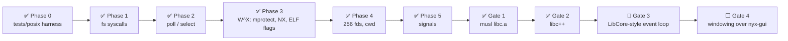
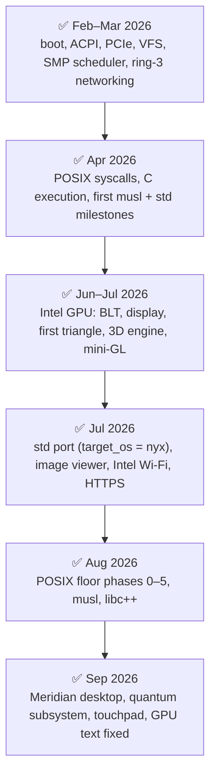

# Roadmap

Where Nyx has been and where it is going. Dates are commit dates from `git log`; statuses are
checked against the tree, not against old plans.

✅ done · 🚧 in progress · 🧪 experimental · ⬜ planned

## The current goal: a real browser engine on Nyx

The active track is a **POSIX floor** solid enough for a C/C++ userland, then musl, then libc++,
then the Ladybird browser engine.

| Step | Status | Evidence in the tree |
|---|---|---|
| Phases 0–5 | ✅ | `tests/posix` (the conformance probe), real `poll`/`select`, `mprotect`, per-segment ELF permissions, `FD_MAX = 256`, `rt_sigaction`/`rt_sigreturn`/`kill` |
| Gate 1 — musl | ✅ | `vendor/musl`, `vendor/musl-patches`, `Build-musl.sh`, `tests/helloc/hello.c` |
| Gate 2 — libc++ | ✅ | `Build-libcxx.sh`, `tests/helloc/cpptest.cpp`, `cxxtest.cpp` |
| Gate 3 — event loop | 🚧 | `EINTR` from `poll`/`select` and socket loops; `tests/helloc/eventloop.cpp` exercises poll + signals + timers + threads together. The Ladybird port itself: *Status: verification required* — no Ladybird sources are in this repository |
| Gate 4 — windowing | ⬜ | |

## History

### Intel graphics

The original GPU roadmap (formerly `IMPROVEMENT.TXT`), all complete:

| Phase | Status |
|---|---|
| 1 — PCI, MMIO, enable device | ✅ |
| 2 — GGTT | ✅ |
| 3 — blitter ring | ✅ |
| 4 — BLT fill | ✅ |
| 4.5 — display engine (owned scanout, page flip, cursor plane) | ✅ |
| 5 — render engine: 3D pipeline and shaders | ✅ first triangle 2026-07-07 (`2a2d3d4`); mini-GL in windows 2026-07-10 |
| GPU compositing and GPU text | ✅ — broken on hardware from July until 2026-09-23 (MOCS lost across RC6); fixed, see [GRAPHICS.md](GRAPHICS.md) |

### Userspace platform

The std / image viewer / on-device compiler workstreams (formerly `NYX-Evolution.txt`, archived in
[archive/userspace-evolution.md](archive/userspace-evolution.md)) are all ✅: Rust `std` runs on
Nyx, `terminal`/`notepad`/`qcstudio` are `std` apps, and QCLang compiles on the device.

### Desktop

✅ Meridian (`apps/shell`) replaced the earlier compositor and desktop, and is the only window server
(2026-09-09, `3b2785f`). See [UI.md](UI.md).

### Networking

✅ Wired (RTL8168) and Wi-Fi (Intel 9462-class: firmware, scan, WPA2, DHCP), smoltcp TCP/IP,
HTTPS via rustls, and the terminal's text browser. The earlier graphical browser (`apps/browser` +
`libs/web`) was removed on 2026-09-03 (`f0ec92e`) in favour of text browsing and the POSIX track.
See [network-architecture.md](network-architecture.md).

### Quantum

✅ The QPU as a third compute substrate, with a Bell state measured on a real IBM QPU from Nyx
(2026-09-22, `b60462c`). See [quantum/](quantum/architecture.md).

### Input

✅ I2C-HID precision touchpad with gestures (2026-09-23), cross-core input wakeups.

## Open items

| Item | Status |
|---|---|
| Gate 3 / Ladybird | 🚧 |
| Modifier chords (Ctrl/Alt shortcuts) | ⬜ — the keyboard path drops them; see [UI.md](UI.md#known-limitations) |
| Audio | ⬜ no driver |
| IPv6 | ⬜ absent by decision — [network-audit.md](network-audit.md) |
| AHCI block I/O | ⬜ controller + port detection only |
| Gen11 / Gen12 GPUs | 🧪 recognised, untested |
| USB HID on hardware | 🧪 verification required |
