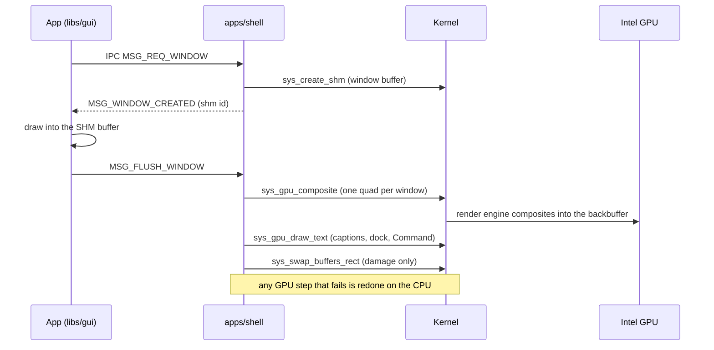
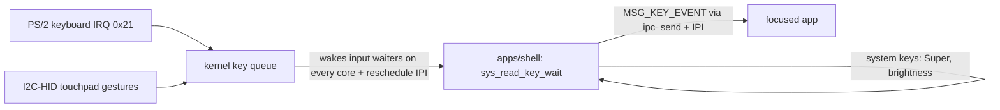

# The desktop: Meridian

Nyx's desktop is **Meridian**, drawn by one userspace program: `apps/shell`, the window server.
It is the only window server — the earlier `apps/compositor` was retired, and there is no fallback
desktop (recovery is the terminal).

Status markers: 🟢 implemented · 🟡 experimental · 🔴 broken · 🚧 in progress · ⬜ planned.

## What it looks like

From the module docs of `apps/shell/src/main.rs`:

- **No panel, no menu bar, no taskbar.** The permanent chrome is a **dock** of glyphs resting on the
  wallpaper at bottom-left and a mark at bottom-right. The dock is the launcher.
- **Windows have no frame.** An app's name sits on a thin caption line *above* its surface; the
  surface is exactly the app's pixels with a hairline and rounded corners.
- **Fold instead of minimise.** A folded window collapses to its caption and stays where it was.
  Double-clicking a caption maximises.
- **The Command** (Super key) is the search/launch surface.

Type: **Inter** (UI) and **JetBrains Mono** (code/terminal), embedded from `libs/meridian/fonts/`
and rasterised into a multi-size coverage atlas at startup.

## How a frame is made

Window pixels are never copied through IPC: each window is a shared-memory buffer that the shell
maps into the GPU's address space and draws as a textured quad. See [GRAPHICS.md](GRAPHICS.md).

## How a keystroke arrives

## The window protocol

IPC message types are defined in `libs/api` (`MSG_*`): window request / created / flush / close /
resize, SHM update and the `MSG_SHM_RELEASED` handshake that frees a resized-away buffer, key and
mouse events, scroll, and theme changes. Apps normally don't speak it directly: they implement
`nyx_gui::app::NyxApp` (title, size, draw, key and mouse handlers) and `libs/gui` runs the loop.

## Libraries

| Crate | Role |
|---|---|
| `libs/meridian` | the design system: tokens, fonts, glyph/icon atlas, shapes, layout, motion, cursors |
| `libs/gui` | app-side toolkit: canvas, drawing, effects, the `NyxApp` event loop, GPU text helpers |
| `libs/entity` | the Entity creature (seed → appearance), host-tested against the design generator |
| `libs/image` | BMP/TGA/PNG and (optionally) JPEG decoders |

## Applications

| App | Kind | What it is |
|---|---|---|
| `shell` | `no_std` | window server, dock, Command |
| `terminal` | `std` | shell commands, diagnostics (`sched`, `gpu`, `touchpad`, `acpi`, `quantum`…) and the text web browser — see [terminal-browser.md](terminal-browser.md) |
| `notepad` | `std` | text editor (saves with **F2** — see limitations) |
| `explorer` | `no_std` | file browser |
| `imageviewer` | `no_std` | image viewer |
| `sysmon` | `no_std` | system monitor |
| `settings` | `no_std` | settings |
| `qcstudio` | `std` | on-device QCLang compiler and circuit view |
| `glcube` | `no_std` | mini-GL validation app |
| `wifiagent` | `no_std` | headless: rejoins the remembered network at boot, and runs radio operations for the shell's network picker |
| `stdgui` | `std` | proof that a `std` binary can drive the `no_std` GUI stack |
| `init` | `no_std` | PID 1 |

`std` apps are built by `Build-std.sh` for `target_os = "nyx"` (see [BUILD.md](BUILD.md)).

## Known limitations

- **No modifier chords.** The keyboard path is character-wide end to end and drops Ctrl/Alt
  (`HandleControl::Ignore` in `nyx-kernel/src/shell.rs`), so shortcuts like `Ctrl+S` cannot be
  expressed. Apps use function keys instead.
- **No audio.** The volume OSD reports that there is no audio device.
- **The shell must never block.** It *is* the window server; every wait it makes has a timeout
  (`sys_read_key_wait` is called with 2 ms).
